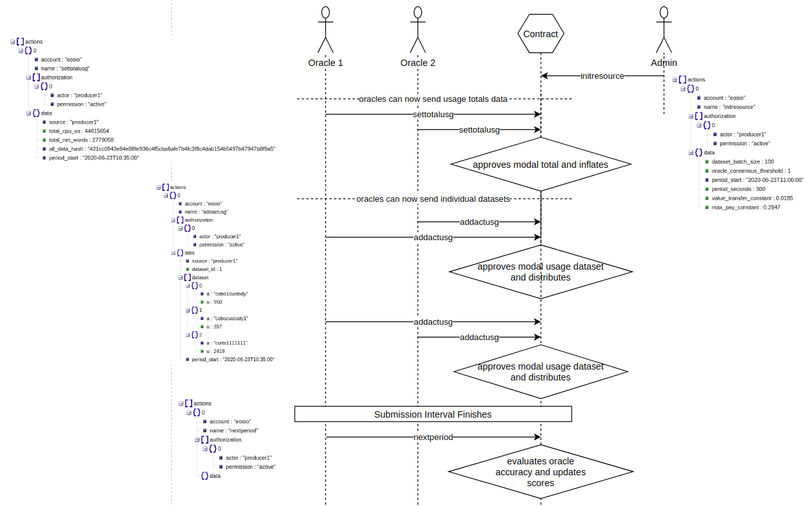

## EOSIO Resource Usage Oracle

Python app which collates CPU/NET usage for all accounts interacting with the blockchain each day. It gathers from the get_blocks nodeos API in the `aggregator` process, and submits to an EOSIO oracle contract after the period has ended in the `submitter` process.

It stays aware of the state of the contract and sends the total system CPU/NET usage for the period, and then the individual account CPU usage totals in several actions as determined by the contract. It resubmits any data that doesn't make it into an irreversible block.

Data is stored in Redis which is persisted to file every 5 minutes.

All data is pruned to the most recent 28 days worth.

Data submission uses a small node.js Express http server, as I'm not aware of an efficient Python library for pushing transactions.

### How to run

1) Install docker and docker-compose
2) Create the config.env file like the template, and modify as required
3) `docker-compose up -d`

### To monitor log file
`tail -f python/debug.log`

...or for just errors...

`tail -f python/debug.log | grep 'ERROR'`

### To delete retained redis data
1) `docker-compose down`
2) `rm redis/dump.rdb`

### TODO
- Prevent contract reconfiguration from requiring existing data to be deleted manually